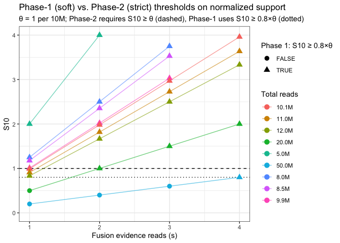
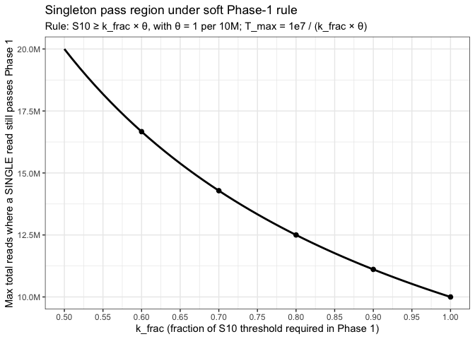

examine_thresholding_impacts
================
bhaas
2025-09-10

``` r
library(dplyr)
library(ggplot2)
library(scales)
```

    ## 
    ## Attaching package: 'scales'

    ## The following object is masked from 'package:purrr':
    ## 
    ##     discard

    ## The following object is masked from 'package:readr':
    ## 
    ##     col_factor

``` r
# ----- Parameters -----
theta <- 1.0            # S10 threshold (≥ 1 per 10M)
k_frac <- 0.80          # Phase-1 must meet 80% of theta
total_reads_list <- c(5e6, 8e6, 8.5e6, 9.9e6, 1.01e7, 1.1e7, 1.2e7, 2e7, 5e7)
support_reads_list <- 1:4

# ----- Helper -----
S10 <- function(s, T) s * (1e7 / T)

# ----- Data grid -----
df <- expand.grid(
  Total_reads = total_reads_list,
  Support_reads = support_reads_list
) %>%
  mutate(
    S10 = S10(Support_reads, Total_reads),
    Pass_phase1 = S10 >= (k_frac * theta),
    Pass_phase2 = S10 >= theta,
    Total_reads_M = paste0(number(Total_reads/1e6, accuracy = 0.1), "M")
  )

# ----- Plot: S10 vs. support reads -----
ggplot(df, aes(x = Support_reads, y = S10,
               color = Total_reads_M, shape = Pass_phase1, group = Total_reads_M)) +
  geom_hline(yintercept = theta, linetype = "dashed") +
  geom_hline(yintercept = k_frac * theta, linetype = "dotted") +
  geom_line(alpha = 0.6) +
  geom_point(size = 3) +
  scale_y_continuous("Scaled support S10 (reads per 10M)", limits = c(0, max(df$S10) * 1.05)) +
  scale_x_continuous("Fusion evidence reads (s)", breaks = support_reads_list) +
  labs(
    color = "Total reads",
    shape = paste0("Phase 1: S10 ≥ ", k_frac, "×θ"),
    title = "Phase-1 (soft) vs. Phase-2 (strict) thresholds on normalized support",
    subtitle = paste0("θ = ", theta, " per 10M; Phase-2 requires S10 ≥ θ (dashed), Phase-1 uses S10 ≥ ", k_frac, "×θ (dotted)")
  ) +
  theme_bw() +
    ylim(0,4)
```

    ## Scale for y is already present.
    ## Adding another scale for y, which will replace the existing scale.

    ## Warning: Removed 5 rows containing missing values (`geom_line()`).

    ## Warning: Removed 5 rows containing missing values (`geom_point()`).

<!-- -->

``` r
library(ggplot2)
library(dplyr)
library(scales)

# Parameters
theta <- 1.0                 # S10 threshold (per 10M)
k_fracs <- seq(0.5, 1.0, by = 0.01)  # fraction of theta required in Phase 1

# Compute T_max where a singleton (s=1) still passes Phase 1
df <- tibble(
  k_frac = k_fracs,
  T_max = 1e7 / (k_frac * theta),           # in reads
  T_max_M = T_max / 1e6                     # in millions of reads
)

ggplot(df, aes(x = k_frac, y = T_max_M)) +
  geom_line(size = 1) +
  geom_point(data = df %>% filter(k_frac %in% c(0.6, 0.7, 0.8, 0.9, 1.0)),
             size = 2) +
  scale_y_continuous("Max total reads where a SINGLE read still passes Phase 1",
                     labels = label_number(accuracy = 0.1, suffix = "M")) +
  scale_x_continuous("k_frac (fraction of S10 threshold required in Phase 1)",
                     breaks = seq(0.5, 1.0, by = 0.05)) +
  labs(
    title = "Singleton pass region under soft Phase-1 rule",
    subtitle = paste0("Rule: S10 ≥ k_frac × θ, with θ = ", theta, " per 10M; ",
                      "T_max = 1e7 / (k_frac × θ)")
  ) +
  theme_bw()
```

    ## Warning: Using `size` aesthetic for lines was deprecated in ggplot2 3.4.0.
    ## ℹ Please use `linewidth` instead.
    ## This warning is displayed once every 8 hours.
    ## Call `lifecycle::last_lifecycle_warnings()` to see where this warning was
    ## generated.

<!-- -->
